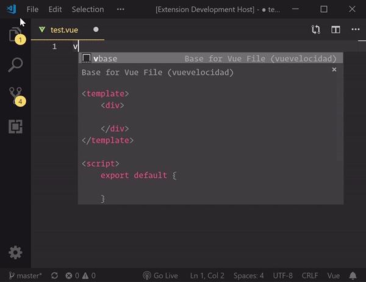

# Vue Velocidad

<p align="center">
  <a href="vuevelocidad.netlify.com" target="_blank">
    
  </a>
</p>

Vue Velocidad is a very opinionated Vue VsCode snippet extension, which modifies and updates [vue-vscode-snippets](https://github.com/sdras/vue-vscode-snippets), best used with Vue-Cli 3.

## Install

Either click [this link](vscode:extension/davidBernegger.vuevelocidad) or install it from the commandline

```batch
code --install-extension davidbernegger.vuevelocidad
```

<p align="center">
  <a href="vuevelocidad.netlify.com" target="_blank">
    
  </a>
</p>

## Snippets

### Data

|prefix         | Expression        |
|---------------|-------------------|
|vdata            | data: {}        |  
|vmethod          | method: {}      |
|vcomputed        | computed: {}    |
|vwatch           | watch: {}       |
|vwatch-options   | watch: {...}    |
|vprops           | props: {}       |
|vcomponents      | components: {}  |
|vfilter          | filters: {}     |
|vmixin           | mixins: []      |

### Template

|prefix         | Expression        |
|---------------|-------------------|
|vfor           | v-for             |  
|vmodel         | v-model           |  
|von            | v-on              |  
|vimg           | image source      |  
|vstyle         | bind style        |  
|vstyle-arr     | bind 2+ styles    |  
|vclass         | bind class        |  
|vclass-arr     | bind 2+ classes   |  
|vanim          | transition comp   |  
|vanim--hook    | in script    |  

### Life Cycle Hooks

|prefix         | Expression        |
|---------------|-------------------|
|vbcreate       | beforeCreate()    |  
|vcreated       | created()         |
|vbmount        | beforeMount()     |
|vmounted       | mounted()         |
|vbupdate       | beforeUpdate()    |
|vupdated       | updated()         |
|vbdestroy      | beforeDestroy()   |
|vdestroyed     | destroyed()       |

### VueX

|prefix         | Expression              |
|---------------|-------------------------|
|vcommit        | this.$store.commit()    |  
|vdispatch      | this.$store.dispatch()  |
|vmapgetters    | ..mapGetters({...})     |
|vmapstate      | ..mapState({...})       |
|vstore         | vuex store base         |
|vstore-import  | import vuex store       |
|vgetters       | getters: {...}          |
|vmutations     | muations: {...}         |
|vactions       | actions: {...}          |

### Other

|prefix         | Expression                            |
|---------------|---------------------------------------|
|vtest          | unit test                             |
|vnextick       | next Tick                             |
|vscss          | import external scss in vue.config.js |